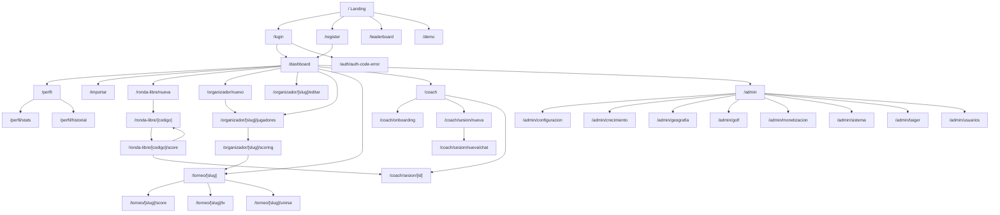
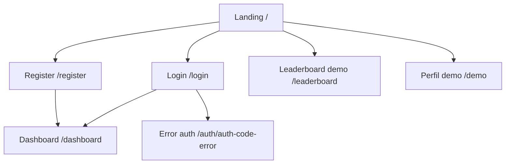
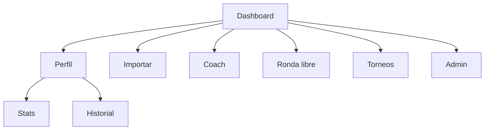
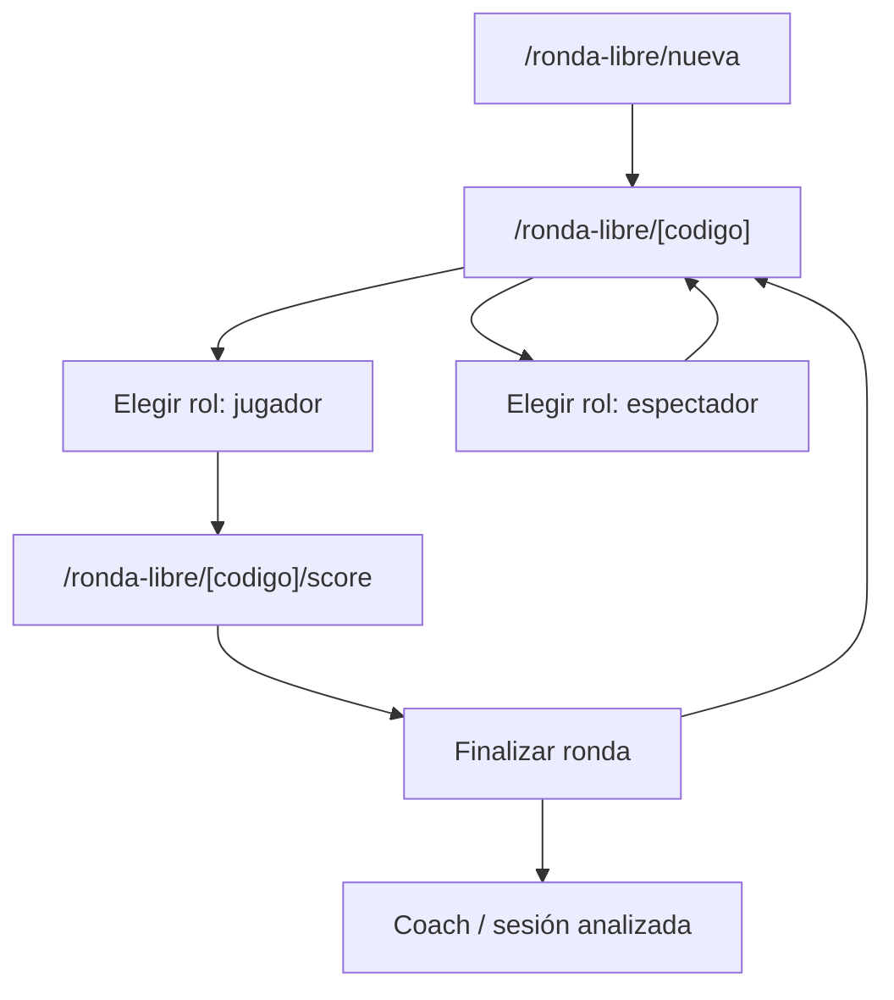
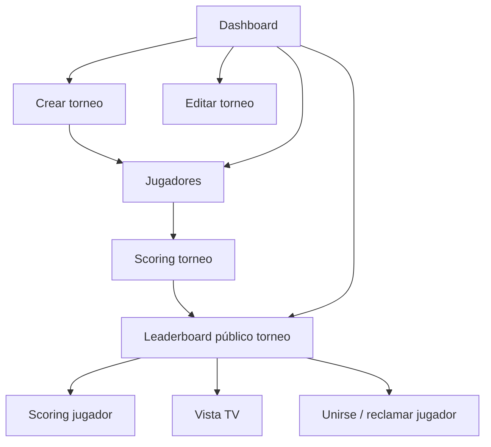
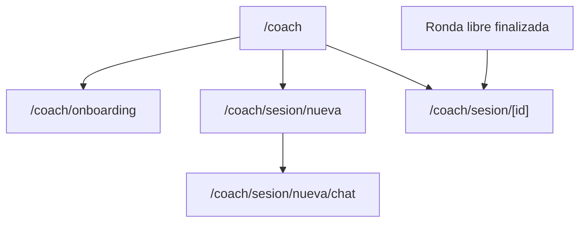
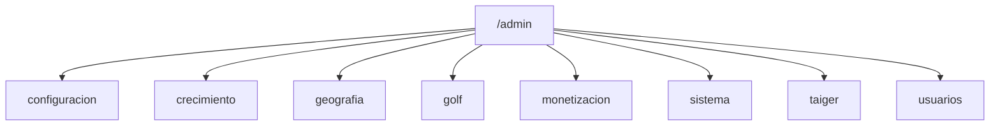

# MAPA ACTUAL DE VENTANAS Y FLUJOS

## Objetivo
Mapa de todas las pantallas detectadas actualmente en `src/app` para revisión de estrategia de producto y flujo de usuario.

## Inventario actual de ventanas

### Públicas / adquisición
- `/` — Landing principal
- `/leaderboard` — Leaderboard demo / broadcast
- `/demo` — Perfil demo
- `/login` — Iniciar sesión
- `/register` — Registro
- `/auth/auth-code-error` — Error de autenticación

### Core app
- `/dashboard` — Dashboard principal
- `/perfil` — Perfil
- `/perfil/stats` — Estadísticas
- `/perfil/historial` — Historial
- `/importar` — Importador

### Ronda libre
- `/ronda-libre/nueva` — Crear ronda libre
- `/ronda-libre/[codigo]` — Entrada por código / elegir rol / vista ronda
- `/ronda-libre/[codigo]/score` — Scoring ronda libre

### Torneos públicos / jugador
- `/torneo/[slug]` — Leaderboard público del torneo
- `/torneo/[slug]/score` — Scoring jugador de torneo
- `/torneo/[slug]/tv` — Vista TV / broadcast
- `/torneo/[slug]/unirse` — Reclamarse como jugador

### Organizador
- `/organizador/nuevo` — Crear torneo
- `/organizador/[slug]/editar` — Editar torneo
- `/organizador/[slug]/jugadores` — Gestionar jugadores
- `/organizador/[slug]/scoring` — Scoring oficial del torneo

### Coach / insights
- `/coach` — Dashboard del tAIger
- `/coach/onboarding` — Onboarding coach
- `/coach/sesion/nueva` — Elegir tipo de sesión
- `/coach/sesion/nueva/chat` — Chat de sesión nueva
- `/coach/sesion/[id]` — Sesión guardada

### Admin
- `/admin` — Home admin
- `/admin/configuracion`
- `/admin/crecimiento`
- `/admin/geografia`
- `/admin/golf`
- `/admin/monetizacion`
- `/admin/sistema`
- `/admin/taiger`
- `/admin/usuarios`

## Diagrama general

## Diagrama por áreas

### 1. Adquisición y acceso

### 2. Núcleo de usuario autenticado

### 3. Ronda libre

### 4. Torneos

### 5. Coach / tAIger

### 6. Admin

## Lectura estratégica rápida

### Lo que está bien
- El producto ya tiene varios loops claros:
  - adquisición → login/register → dashboard
  - dashboard → ronda libre → score → regreso / coach
  - dashboard → crear torneo → jugadores → scoring → leaderboard
  - dashboard → perfil → stats / historial
- Hay separación entre experiencia pública, privada, organizador, jugador y admin.
- El core estratégico del producto sí existe y está expresado en rutas reales.

### Lo que se ve fragmentado
- Hay demasiados “centros” potenciales:
  - dashboard
  - perfil
  - coach
  - leaderboard
  - ronda libre por código
- El árbol muestra una app con mucho alcance, pero con varios subproductos coexistiendo:
  - juego social
  - torneo competitivo
  - perfil/analytics
  - coach IA
  - admin
  - importador
  - demo pública
- Para un usuario nuevo, el mapa de navegación todavía puede sentirse más amplio que priorizado.

### Lo que parece más fuerte como flujo principal hoy
- `Dashboard -> Ronda libre -> Score -> Vuelta a ronda / coach`
- `Dashboard -> Crear torneo -> Jugadores -> Scoring -> Leaderboard`

### Lo que parece más débil a nivel de arquitectura
- `Coach` está bien conectado, pero todavía aparece como un módulo paralelo más que como parte orgánica del loop principal.
- `Importar` y `Historial` aportan valor, pero no están tan claramente integrados al journey principal.
- `Demo` y `Leaderboard demo` son útiles para adquisición, pero conviene definir mejor su papel exacto.

## Recomendaciones de mejora

### 1. Definir un north star flow único
Hoy la app tiene varios caminos fuertes, pero conviene elegir uno como flujo principal de producto:
- opción A: `jugar y registrar`
- opción B: `organizar y seguir torneos`
- opción C: `mejorar con datos y coach`

Sin esa priorización, el producto puede sentirse rico pero disperso.

### 2. Reordenar mentalmente el producto en 4 pilares
Una estructura más clara para estrategia y navegación sería:
- Jugar
- Competir
- Analizar
- Gestionar

Eso ayudaría a bajar complejidad tanto en navegación como en comunicación de valor.

### 3. Hacer que dashboard sea el verdadero hub
El mapa actual sugiere que `dashboard` ya es el centro, pero todavía compite con otros hubs parciales. Conviene que desde ahí quede clarísimo:
- qué sigue haciendo el usuario
- qué está activo ahora
- cuál es el acceso más frecuente

### 4. Integrar mejor coach con los loops reales
Hoy coach aparece como módulo aparte. Estratégicamente conviene conectarlo más con:
- post ronda libre
- post torneo
- historial
- stats

La sensación ideal es que el coach sea una consecuencia natural del uso, no un producto paralelo.

### 5. Separar con más claridad experiencias públicas vs privadas
El mapa mezcla:
- demo pública
- leaderboard público
- scoring privado
- dashboard privado

Eso está bien, pero conviene ordenar mejor el modelo mental:
- público: descubrir, mirar, seguir
- privado: jugar, gestionar, analizar

### 6. Decidir qué hacer con `importar`
Hoy `importar` existe como ventana separada. Estratégicamente hay que definir si es:
- una herramienta secundaria dentro de historial
- una puerta principal de onboarding de datos
- un módulo pro

Si no se define, queda como isla.

### 7. Revisar si `perfil`, `stats` e `historial` deben seguir separados
Ahora son tres ventanas distintas. Puede ser correcto, pero estratégicamente vale la pena revisar si:
- perfil debe ser identidad
- stats debe ser performance
- historial debe ser input / memoria

Si no se diferencia con fuerza, pueden sentirse como fragmentos de un mismo espacio.

### 8. Mantener admin totalmente desacoplado del mapa principal
El árbol admin está bien como backoffice, pero no debería contaminar el modelo mental del producto core. Estratégicamente conviene mantenerlo fuera de cualquier narrativa principal.

## Recomendación concreta para la próxima revisión
Haría la revisión con estas 3 preguntas:

1. ¿Cuál es el flujo principal que queremos que más usuarios hagan cada semana?
2. ¿Qué pantallas existen solo porque “son útiles” vs cuáles sostienen retención real?
3. ¿Qué módulos hoy deberían integrarse mejor en un loop principal y cuáles deberían quedar claramente secundarios?

## Archivos base usados para este mapa
- `src/app/**/page.tsx`
- rutas detectadas en App Router al 2026-03-24
